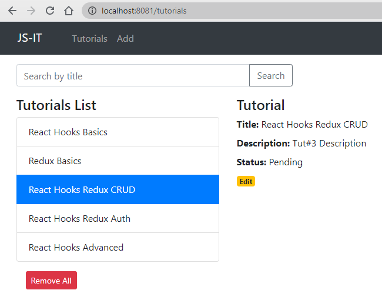

# React Hooks + Redux CRUD example with Axios & Web API
Build React Redux Tutorial Application with Rest API calls in that:
- Each Tutorial has id, title, description, published status.
- We can create, retrieve, update, delete Tutorials.
- There is a Search bar for finding Tutorials by title.



Redux Store:


Fullstack with Node.js Express:
> [React + Node.js Express + MySQL](https://github.com/JS-IT/react-node-express-mysql/)

### Set port
.env
```
PORT=8081
```

## Project setup

In the project directory, you can run:

```
npm install
# or
yarn install
```

or

### Compiles and hot-reloads for development

```
npm start
# or
yarn start
```

Open [http://localhost:8081](http://localhost:8081) to view it in the browser.

The page will reload if you make edits.
